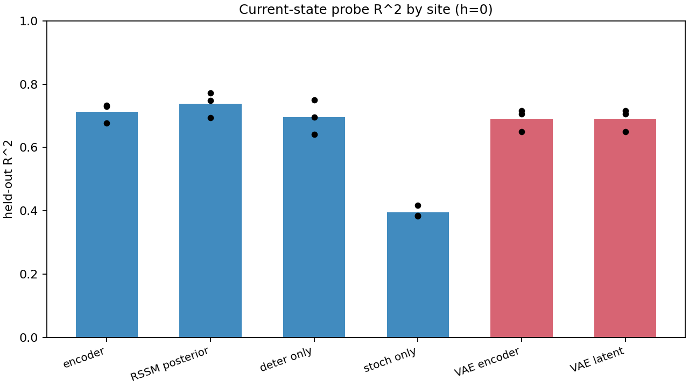
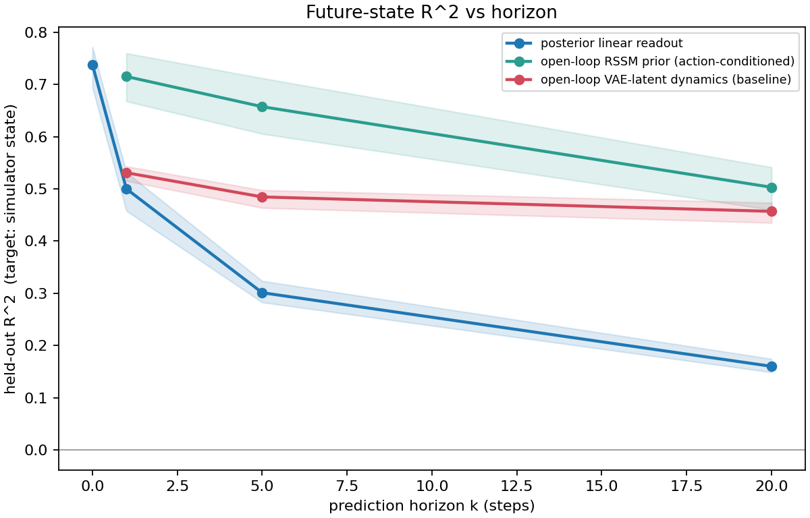
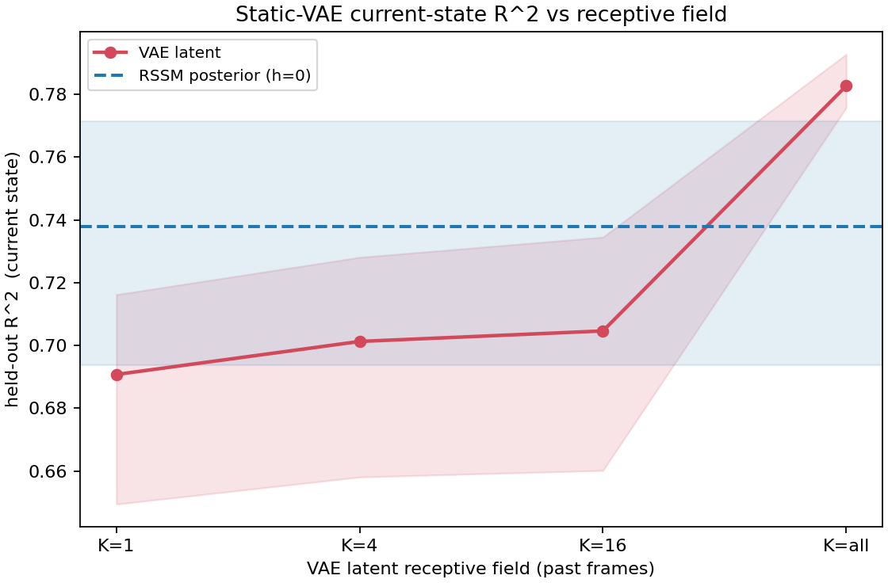
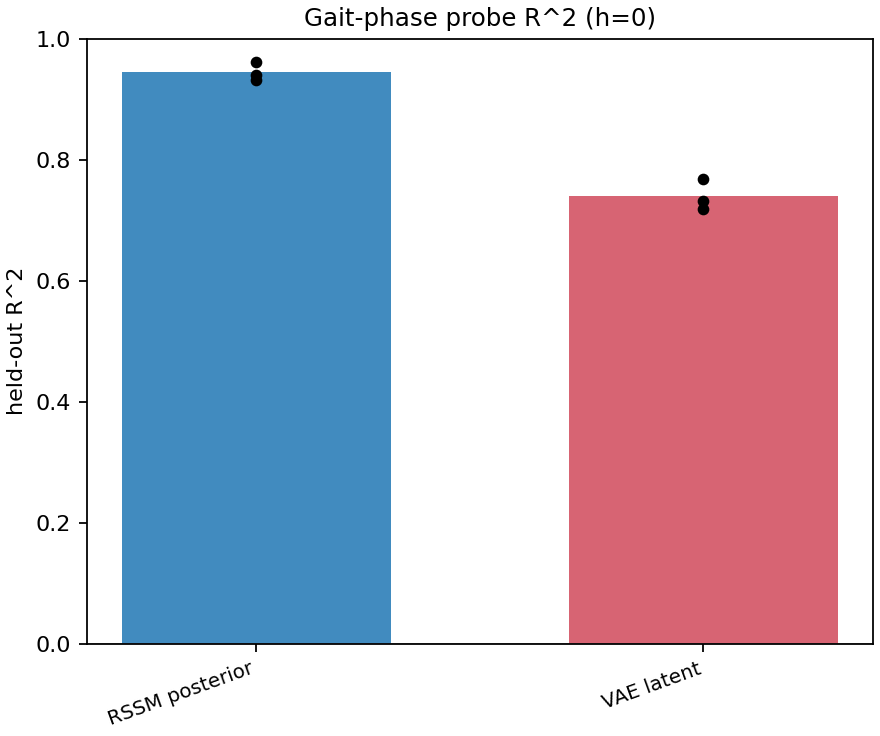
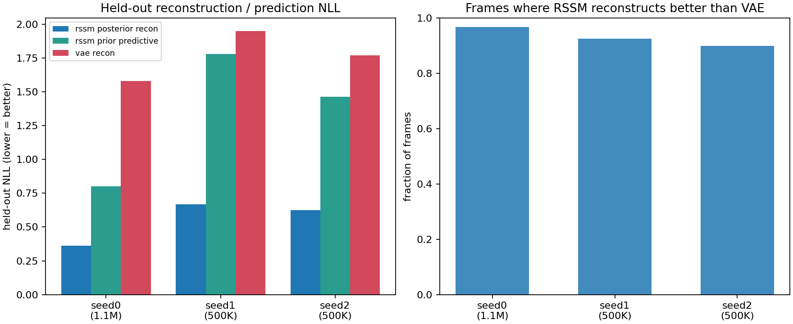
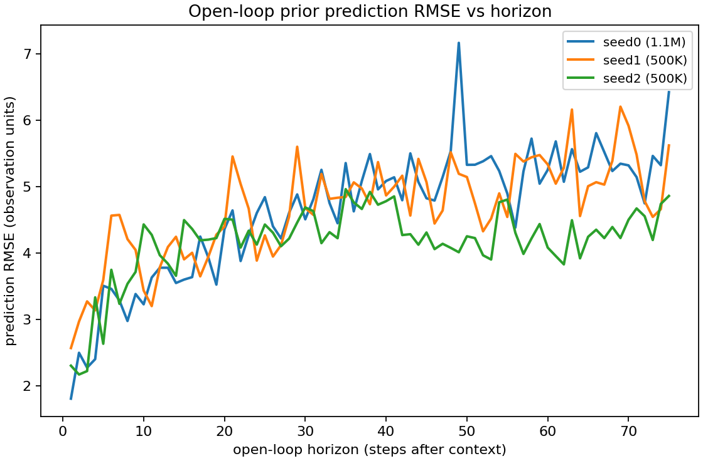
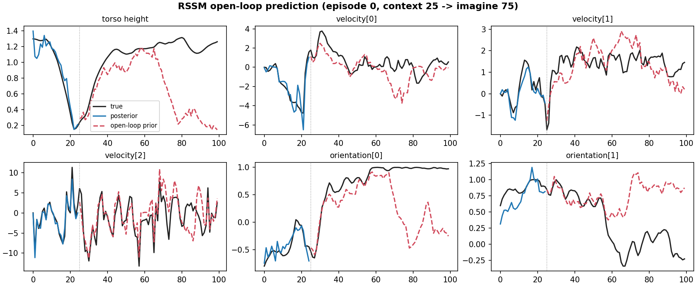

# Summary results — what the sequential generative latent encodes

Frozen DreamerV3 RSSM vs a static frame-level VAE, DMC proprio Walker-Walk,
3 seeds (**seed 0 = 1.1M** training steps, **seeds 1–2 = 500K**). All R² are
held-out ridge-probe scores against the train-set mean baseline. Figures carry
factual titles only; the interpretation of each is below. Build with
`python result_images/build_summary_figures.py`.

---

### `current_state_probe_r2_by_site.png`

**Per-frame current-state content is roughly the same for both models, and the
RSSM's small edge lives in its deterministic state, not its stochastic latent.**
Encoder, RSSM posterior, RSSM `deter`, VAE encoder and VAE latent all decode the
current simulator state at R² ≈ 0.69–0.74. The posterior's +0.05 over the VAE
comes entirely from the 512-d deterministic recurrent state (`deter` ≈ 0.70);
the categorical **`stoch` latent alone is a poor linear state code (≈ 0.40)**.
At equal width (128-d), the continuous VAE latent (0.69) decodes state *better*
than the RSSM's categorical stochastic latent (0.40) — so the RSSM only leads
at h=0 because it carries a much larger deterministic state, not because the
generative latent is intrinsically richer per frame.

---

### `future_state_r2_by_horizon_posterior_vs_prior.png`

**This is where the world model earns its keep, but the static baseline is now
stronger.** Reading the future linearly off the RSSM posterior decays fast
(R² 0.74 → 0.50 → 0.30 → 0.16 at k = 0/1/5/20). Rolling the **RSSM prior
forward with the recorded actions** stays higher (0.72 → 0.66 → 0.50 at
k = 1/5/20). A learned action-conditioned dynamics model in the static VAE's
latent space also recovers much of the future state (0.53 → 0.49 → 0.46). Under
the primary ridge probe, the RSSM prior still leads at every horizon and within
every seed, but the gap narrows from +0.18 at 1 step to +0.05 at 20 steps. Under
the MLP probe, the RSSM and VAE-dynamics baselines are essentially tied at the
longest horizon. The sequential model's value is predictive, not in
current-state encoding, and the head-to-head advantage is strongest in the
linear-probe setting.

---

### `vae_receptive_field_r2.png`

**A static VAE recovers — and exceeds — the RSSM's current-state advantage just
by aggregating past frames.** The VAE latent rises from R² ≈ 0.69 (1 frame) to
≈ 0.78 at K = all, overtaking the RSSM posterior reference (≈ 0.74). So for
*current observable state*, recurrence provides essentially nothing that simple
post-hoc temporal aggregation of static features can't reproduce. This makes the
"static vs sequential" contrast empirical rather than assumed: the gap at the
current state is small and closes under aggregation.

---

### `gait_phase_r2_rssm_vs_vae.png`

**The cleanest dimensionality-independent sequential win.** Gait phase — a
cyclic dynamical quantity that a single frame cannot disambiguate (same pose
occurs at two phases) — is decoded at R² ≈ 0.95 from the RSSM posterior vs
≈ 0.74 from the static VAE latent (+0.21, consistent across all three seeds).
This is the kind of content the recurrent latent encodes that a per-frame model
genuinely cannot.

---

### `generative_nll_and_reconstruction_advantage.png`

**Generative quality and probe quality decouple.** *Left:* the RSSM reconstructs
the current frame with much lower held-out NLL than the VAE, and its NLL keeps
dropping sharply from 500K→1.1M (seed 0 ≈ 0.36 vs seeds 1–2 ≈ 0.62–0.67) — yet
its current-state probe R² is within seed noise of the others (see figure 1).
So better reconstruction does **not** buy proportionally more linearly-decodable
state; generative fidelity improves with capacity/training well past the point
where probe content saturates. *Right:* the RSSM reconstructs better than the
VAE on 90–97% of frames, so the advantage is consistent, not occasional. (It is
also uniform across motion intensity, r ≈ 0 — "consistently better," not "better
at transients.")

---

### `openloop_prediction_rmse_vs_horizon.png`

**Quantitative view of the predictive component.** Starting from a 25-step
posterior context, open-loop prior rollout error grows smoothly with horizon
(RMSE ≈ 1.8–2.6 at 1 step → ≈ 4.9–6.4 at 75 steps), mirroring the prior-R²
decay in figure 2. The error accumulates gradually rather than diverging
immediately, indicating the dynamics model captures the short-to-medium-horizon
structure of the gait.

---

### `openloop_example_trajectory_seed0.png`

**"How the world model works" (seed 0, context 25 → imagine 75).** Per state
variable: true (black), posterior reconstruction over the observed window
(blue), open-loop prior prediction over the imagined window (red dashed). The
posterior tracks the truth closely; the prior then carries the gait oscillations
in torso height, velocities and orientations forward for many steps before
gradually drifting. This visualizes directly what figures 2 and 6 quantify — the
predictive component imagines plausible future dynamics, with error growing over
the horizon.

---

## One-paragraph takeaway

Beyond a static VAE, the sequential generative latent does **not** encode more
about the current observable state (a frame-stacking static model matches it).
Its genuine advantages are (1) **cyclic/dynamical structure** — gait phase,
+0.21 R² — and (2) **action-conditioned future state** via learned dynamics.
Against a learned VAE-latent dynamics baseline, the RSSM prior is better under
the primary linear probe (R² ≈ 0.50 vs 0.46 at 20 steps), with the advantage
narrowing at long horizon and becoming a tie under the MLP probe. Generative
fidelity (reconstruction/prediction NLL) improves strongly with capacity and
training while linear state-decodability saturates early, so the two evaluation
lenses agree only partially.
